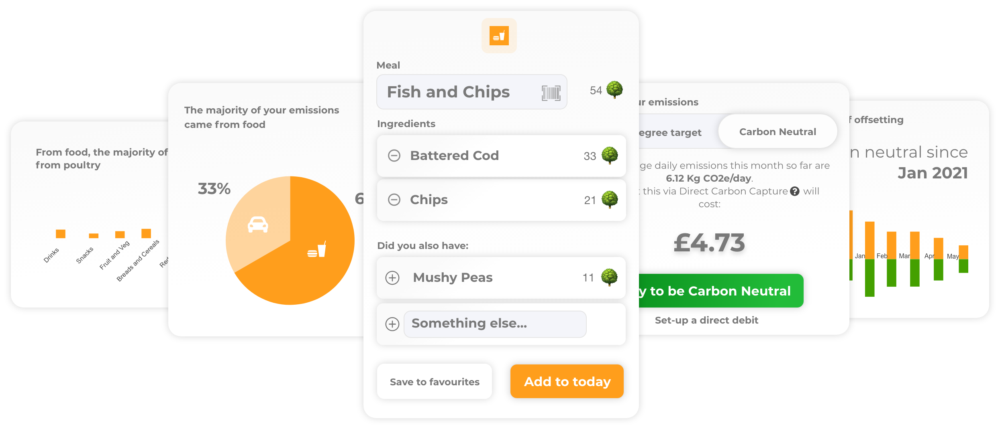
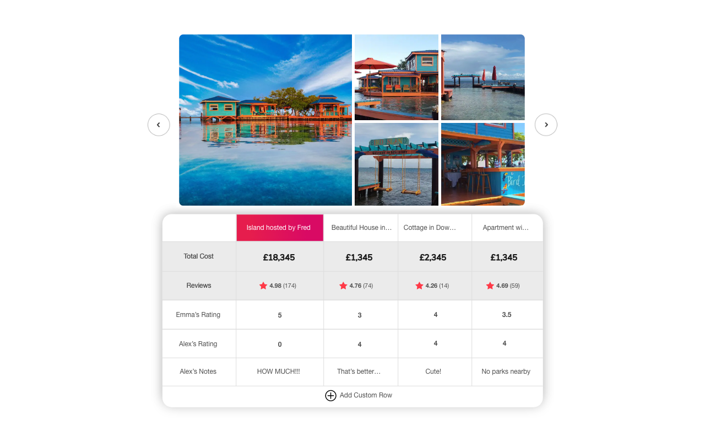
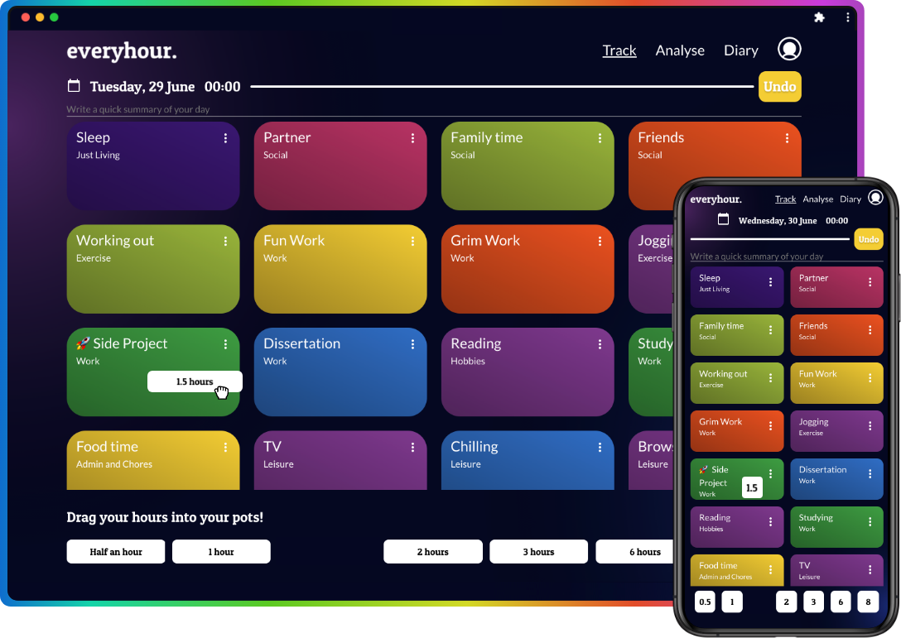

## Hey, I'm Alex 👋

I am building [vula](https://www.vula.vc) to empower a continent to be the future of us all. 

I quit my job in May 2021  to make products I believe should exist. Since then I have built 30 products, 2 turned to businesses and 1 (vula) has been venture backed.

To hear more from me, [message me on twitter](www.twitter.com/AlexCharlesGoff)

## What I am proud of:

- 🌍 [vula](https://www.vula.vc) - A platform for African startups and SMEs to navigate, apply and get financing. [OpenAI, Typescript, Node, Python, Prisma]
 

- 🌳 [treemeals.co](www.treemeals.co) - A carbon counting food diary (did you know orange juice is worse than bacon?!)
  

- 🏡 [compairbnb.info](www.compairbnb.info/hello) - the easiest way to narrow down which airbnb you want to stay in
  

- ⏳ [everyhour.xyz](www.everyhour.xyz) - My way of staying productive - by tracking my life balance.
  
